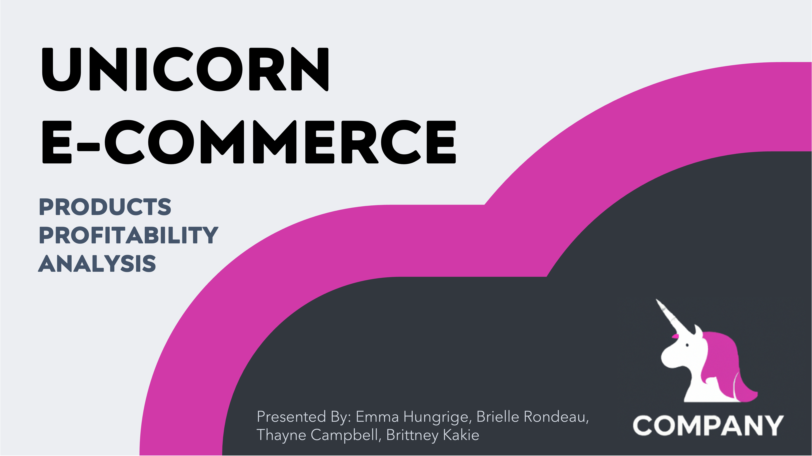

# Brittney Kakie | Jr Data Analyst
## Data Analytics Portfolio

---

#### Hello, and thank you for visiting my project page! I'm Brittney Kakie, a Data Analyst based in Georgia, United States. I discovered my passion for Data Analytics while working as a Pharmacy Automation Analyst at a regional health system. Through Masterschool I was able to acquire skills that I truly enjoy using, such as SQL, Python, and Descriptive Statistics. Please connect with me on LinkedIn for Analytics business inquiries.

 - [LinkedIn](https://www.linkedin.com/in/bkakie/)
---

 
 
 

# Bikeshare Rental Statistics Using Python
This project uses Python to explore data related to bike share systems for three major cities in the United States—Chicago, New York City, and Washington. This program does the following:
- import csv data 
- applies descriptive statistics 
- allows for raw input to create an interactive experience in the terminal to present these statistics.**
- [Program](https://github.com/TheBrittinator/Britt-s_portfolio/blob/0ea515488f8264911383d9a8df0f50a86c914de3/bikeshare_cmp/bikeshare_program.py)

### **Python | Pandas | Error Handling | Descriptive Statistics**
---
 
 
 

# Deforestation Analysis Using SQL
ForestQuery is on a mission to combat deforestation around the world and raise awareness about this topic and its impact on the environment. The data analysis team has used SQL to identify successes as well as areas of concern. This project includes query codes and a detailed report of our findings. 

 * [Analysis Report](https://1drv.ms/b/s!Akf0BCPilEQsgb5lMxpRBs54UK_OlQ?e=29TJs9)
 * [Appendix - SQL Queries](https://1drv.ms/b/s!Akf0BCPilEQsgb5pBQS_UGFktbBGyg?e=bEZYan)

### **PostgreSQL | SQLite | Data Storytelling**
---

 
 
 
 
 

# Profit Analysis Presentation 
E-commerce platforms like Unicorn allow people to buy products online: from books, toys, clothes, and shoes to food, furniture, and other household items. The following dataset includes Unicorn sales data from the years 2015-2018. The DA Team has been asked to analyze the data, find interesting insights and identify weak areas and opportunities for Unicorn to boost business growth.

 * [Tableau](https://public.tableau.com/views/ProfitAnalysis-UnicornE-commerce/UnicornEcommerceDataAnalysis?:language=en-US&:display_count=n&:origin=viz_share_link)
 * [Spreadsheets Dashboard](https://1drv.ms/x/s!Akf0BCPilEQsgb5iUyoYx85e-h8PQw?e=jgmIYW)
 * [Powerpoint Presentation](https://1drv.ms/p/s!Akf0BCPilEQsgb5Y4Lnm_1EDuGnXmw?e=eRqMPa)

### **Python | SQLite | Tableau | Data Visualisation | MicrosoftPowerQuery | Spreadsheets | Data Storytelling** 
---

 
 
 
 
 

# Pokemon Game
This script was completed in conjunction with an instructor teaching Object Oriented Programming with Python. I have a few ideas on how to build this out into an easier to use game!

 * [Pokemon Script](https://github.com/TheBrittinator/Britt-s_portfolio/blob/afa15983380df93bd33fda4ed8383efc83c817da/pokemon.py)

### **Python | Object Oriented Programming**
